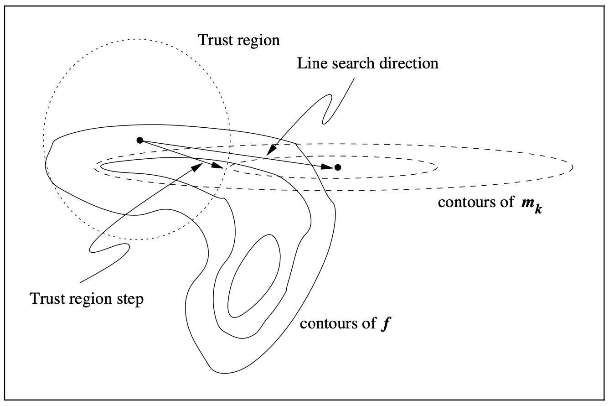

4 Trust-Region Methods
*************************************

.. toctree::
   :maxdepth: 2
   
   chapter4-1
   chapter4-2
   chapter4-3
   chapter4-4
   chapter4-5

Trust-region methods define a region around the current iterate within which they *trust* the model to be an adquate representation of the objective function, and then choose the step to be the approximate minimizer of the model in this region.

The figure below illustrates the trust-region approach on a function :math:`f` of two variables in which the current :math:`x_k` and the minimizer :math:`x^*` lie at opposite ends of a curved valley.

In this chapter, we will assume that the model function :math:`m_k` is quadratic. Moreover, :math:`m_k` is based on the Taylor-series expansion of :math:`f` around :math:`x_k`, which is

.. math::

  f(x_k + p) = f_k + g_k^\top p + \frac{1}{2}p^\top \nabla^2 f(x_k + tp)p

where :math:`g_k = \nabla f(x_k)` and :math:`t \in (0, 1)`. By using an approximation :math:`B_k` to the Hessian in the second order term, :math:`m_k` is defined as

.. math::

  m_k(p) = f_k + g_k^\top p + \frac{1}{2} p^\top B_k p

where :math:`B_k` is some symmetric matrix. We emphasize the generality of the trust-region approach by assuming little about :math:`B_k` except symmetry and uniform boundedness.

To obtain each step, we seek a solution of the subproblem

.. math::

  \min_{p \in \mathbb{R}^n} m_k(p) = f_k + g_k^\top p + \frac{1}{2} p^\top B_k p \;\;\; \text{s.t. } \lVert p \rVert \leq \delta_k

where :math:`\delta_k > 0` is the trust-region radius. In any case, as described below, we need only an *approximate* solution to obtain convergence and good practical behavior.

Outline of the Trust-Region Approach
-------------------------------------

We choose the trust-region radius :math:`m_k` based on the agreement between the model function :math:`m_k` and the object function :math:`f` at previous iterations. Given a step :math:`p_k` we define the ratio

.. math::

  \rho_k = \frac{f(x_k) - f(x_k + p_k)}{m_k(0) - m_k(p_k)}

the numerator is called the *actual reduction* and the denominator is the *predicted reduction*. If :math:`\rho_k` is close to zero or negative, we shrink the trust region by reducing :math:`\delta_k` at the next iteration.

| **Algorithm 4.1** (Trust Region).
|   Given :math:`\hat{\delta} > 0`, :math:`\delta_0 \in (0, \hat{\delta})`, and :math:`\eta \in \left[0, \frac{1}{4}\right)`:
|   **for** :math:`k = 0, 1, 2, \dots`
|     Obtain :math:`p_k` by (approximately) solving :math:`\min_{p \in \mathbb{R}^n} m_k(p) = f_k + g_k^\top p + \frac{1}{2} p^\top B_k p \;\;\; \text{s.t. } \lVert p \rVert \leq \delta_k`;
|     Evaluate :math:`\rho_k`;
|     **if** :math:`\rho_k < \frac{1}{4}`
|       :math:`\delta_{k+1} = \frac{1}{4}\delta_k`
|     **else**
|       **if** :math:`\rho_k > \frac{3}{4}` and :math:`\lVert \rho_k \rVert  = \delta_k`
|         :math:`\delta_{k+1} = \min(2\delta_k, \hat{\delta})`
|       **else**
|         :math:`\delta_{k+1} = \delta_k`;
|     **if** :math:`\rho_k > \eta`
|       :math:`x_{k+1} = x_k + p_k`
|     **else**
|       :math:`x_{k+1} = x_k`;
| **end for**.

Here :math:`\hat{\delta}` is an overall bound on the step lengths.
