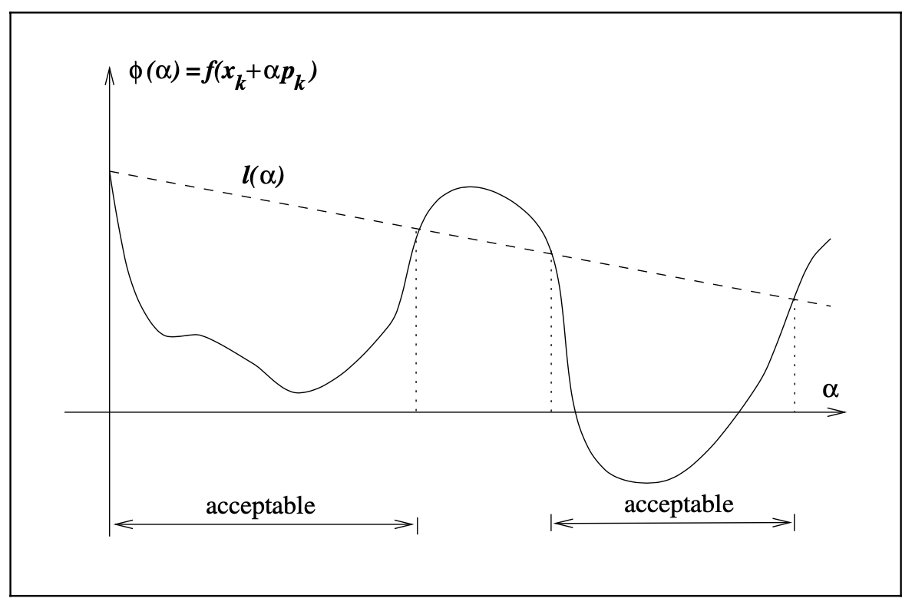

3.1 Introduction
=====================================

In computing the step lenght :math:`\alpha_k`, we face a tradeoff. We would like to choose :math:`\alpha_k` to give a substantial reduction of :math:`f`, but at the same time we do not want to spend too much time making the choice. The ideal choice would be the global optimizer of the univariate function :math:`\phi(\cdot)` defined by

.. math::

  \phi(\alpha) = f(x_k + \alpha p_k), \;\;\; \alpha > 0

but in general, it is too expensive to identify this value. More practical strategies perform an *inexact* line search to identify a step length that achieves adequate reductions in :math:`f` at minimal cost.

Typical line search algorithms try out a sequence of candidate values for :math:`\alpha`, stopping to accept one of these values when certain conditions are satisfied. The line search in done in two stages: A bracketing phase finds an interval containing desirable step lengths, and a bisection or interpolation phase computes a good step length within this interval.

We now discuss various termination conditions for line search algorithms and their effectiveness.

A simple condition we could impose on :math:`\alpha_k` is to require a reduction in :math:`f`, that is, :math:`f(x_k + \alpha_k p_k) < f(x_k)`. However, the insufficient reduction in :math:`f` at each step may cause it to fail to converge to the minimizer. Hence we need to enforce a *sufficient decrease* condition.

The Wolfe Conditions
-------------------------------------

A popular inexact line search condition stipulates that :math:`\alpha_k` should first of all give *sufficient decrease* in :math:`f`, as measured by the inequality:

.. math::

  f(x_k + \alpha p_k) \leq f(x_k) + c_k \alpha \nabla f_k^\top p_k

for some constant :math:`c_1 \in (0, 1)`. This is sometimes called the *Armijo condition*. The intervals on which this condition is satisfied are shown in the figure below. In practice, :math:`c_1` is chosen to be quite small, say :math:`c_1 = 10^{-4}`.

Note that the Armijo condition is satisfied on all sufficiently small values of :math:`\alpha`. To rule out unacceptably short steps we introduce a second requirement, called the *curvature condition*

.. math::

  \nabla f(x_k + \alpha_k p_k)^\top p_k \geq c_2 \nabla f_k^\top p_k

for some constant :math:`c_2 \in (c_1, 1)`. The left-hand-side is simply the derivative :math:`\phi'(\alpha_k)`, so the curvature ensures that the slope of :math:`\phi` at :math:`\alpha_k` is larger than :math:`c_2` times the initial slope :math:`\phi'(0)`. Typical values of :math:`c_2` are 0.9 for Newton or quasi-Newton method, and 0.1 for nonlinear conjugate gradient method.
