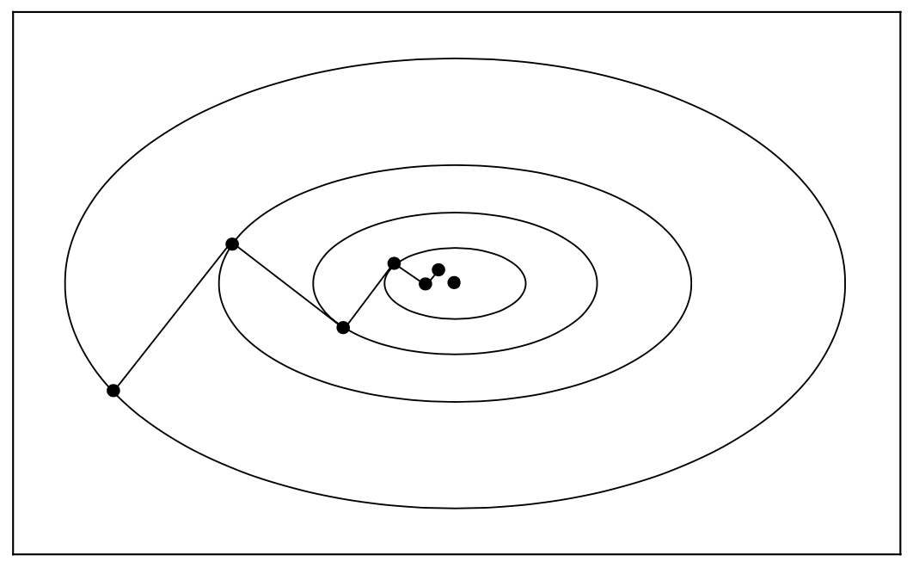

3.3 Rate of Convergence
=====================================

Algorithmic strategies that achieve rapid convergence can sometimes conflict with the requirements of global convergence, and vice versa. The challenge is to design algorithms that incorporate both properties: good global convergence guarantees and a rapid rate of convergence.

Convergence Rate of Steepest Descent
-------------------------------------

Let us suppose that

.. math::

  f(x) = \frac{1}{2} x^\top Q x - b^\top x

where :math:`Q` is symmetric and positive definite. The gradient is given by :math:`\nabla f(x) = Qx - b` and the minimizer :math:`x^*` is the unique solution of the linear system :math:`Qx = b`.

It is easy to compute the step length :math:`\alpha_k` that minimizes :math:`f(x_k - \alpha \nabla f_k)`. By differentiating the funcion :math:`f(x_k - \alpha \nabla f_k)` w.r.t. :math:`\alpha`, we have

.. math::

  & (-\nabla f_k)^\top Q (x_k - \alpha \nabla f_k) + b^\top \nabla f_k = 0 \\
  & -\nabla f_k^\top Q x_k + \alpha \nabla f_k^\top Q \nabla f_k + \nabla f_k^\top b = 0 \\
  & \alpha \nabla f_k^\top Q \nabla f_k - \nabla f_k^\top \nabla f_k = 0 \\
  & \alpha_k = \frac{\nabla f_k^\top \nabla f_k}{\nabla f_k^\top Q \nabla f_k}

Then the steepest descent iteration is given by

.. math::

  x_{k+1} = x_k - \left( \frac{\nabla f_k^\top \nabla f_k}{\nabla f_k^\top Q \nabla f_k} \right) \nabla f_k

which yields a closed-form expression for :math:`x_{k+1}` in terms of :math:`x_k`. In the figure below we plot a tpyical sequence of iterates generated by the steepest descent method on a two-dimensional quadratic objective function.

